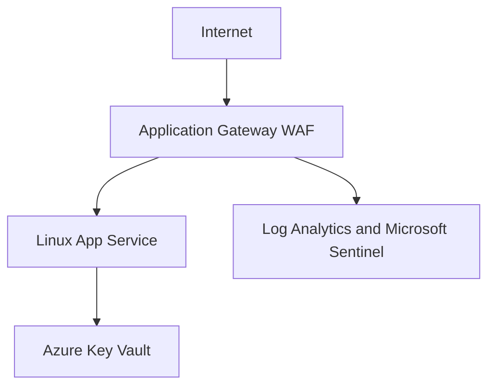

# NorthStar Secure Azure Landing Zone

Terraform-managed Azure security architecture demonstrating network segmentation, governance, identity, SOC monitoring, protected web delivery, and operational validation.

## What This Project Demonstrates

- Modular Terraform infrastructure managed through a locked Azure remote state backend
- Segmented Azure networking with dedicated management, web, application, and WAF subnets
- Azure Policy governance and least-privilege group-based RBAC
- Microsoft Sentinel monitoring, analytics, incident handling, and KQL-based evidence
- Application Gateway WAF protection for a managed Linux App Service workload
- Azure Key Vault access through managed identity and Azure RBAC
- Terraform validation and drift detection against the live Azure environment

## Deployed Architecture

- Region: Canada Central
- Resource group: `NorthStar-Landing-Zone-RG`
- Virtual network: `northstar-lz-vnet` (`10.20.0.0/16`)
- Management subnet: `10.20.3.0/24`
- Web subnet: `10.20.1.0/24`
- Application subnet: `10.20.2.0/24`
- Dedicated WAF subnet: `10.20.10.0/24`
- Default outbound access: disabled on every subnet

## Security Controls

- Management-to-Web traffic is limited to HTTPS on TCP 443.
- Web-to-Application traffic is limited to TCP 8443.
- Each tier has a dedicated Network Security Group.
- Azure Policy audits resources missing the required `Project` tag.
- Cloud Admins receive Contributor only at landing-zone resource-group scope.
- Security Analysts and the automation managed identity receive Reader only at landing-zone resource-group scope.
- Application Gateway uses OWASP CRS 3.2 in WAF Detection mode.
- The App Service allows direct access only from the dedicated WAF subnet and denies all other direct ingress.
- The App Service uses HTTPS, disables FTP and Web Deploy basic authentication, and has a system-assigned managed identity.
- Key Vault uses Azure RBAC; the web application has only the `Key Vault Secrets User` role at vault scope.
- Subscription activity and Application Gateway diagnostics are routed to `NorthStar-SOC-Workspace`.

## Monitoring and Detection

- Microsoft Sentinel is enabled for the SOC workspace.
- Terraform manages the subscription diagnostic setting and Sentinel analytics rule.
- `NorthStar - Failed Azure Control Plane Operation` detects failed control-plane operations in `NorthStar-Azure-RG`.
- Application Gateway access, performance, and WAF logs are collected in Log Analytics.
- Controlled validation confirmed that WAF inspection events reach the SOC workspace.

## Validation Evidence

- Terraform validation completed successfully.
- Terraform drift detection returned: `No changes. Your infrastructure matches the configuration.`
- Application Gateway backend health reported the App Service as `Healthy`.
- A controlled request through the public gateway returned HTTP 200.
- A controlled request triggered OWASP rule `920350`; the WAF logged it as `Matched` in Log Analytics.

## Documentation

- [Sentinel incident response case study](docs/sentinel-incident-case-study.md)
- [Identity and Zero Trust design](docs/identity-zero-trust-design.md)
- [Web front end and WAF architecture](docs/webfront-waf-architecture.md)
- [Implementation decisions and lessons learned](docs/implementation-decisions.md)
- [Application Gateway WAF log validation](docs/waf-log-validation.md)

## Current Limitation

The public Application Gateway listener uses HTTP for lab validation. The Application Gateway-to-App-Service connection uses HTTPS.

A trusted public HTTPS listener requires a verified custom domain and certificate. The intended production pattern is a certificate stored in Azure Key Vault and retrieved by Application Gateway through managed identity.

## Scope

NorthStar is portfolio and lab work, not employer production experience.
