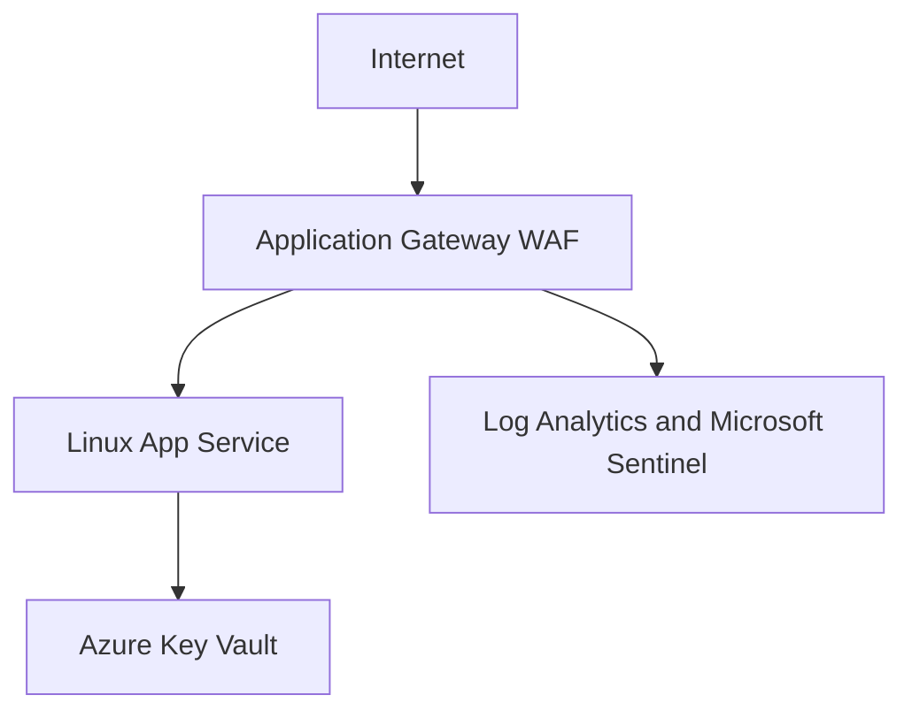

# NorthStar Web Front End and WAF Architecture

## Objective

Provide a cost-aware public application entry point while maintaining segmentation, least privilege, monitoring, and a managed backend.

## Deployed Architecture

## Components

| Component | Implementation |
|---|---|
| WAF subnet | `10.20.10.0/24`, dedicated to Application Gateway |
| Application Gateway | `northstar-lz-app-gateway`, WAF_v2, one public IP |
| WAF policy | `northstar-lz-waf-policy`, OWASP CRS 3.2, Detection mode |
| Backend | Linux App Service running an Nginx container |
| Backend security | App Service HTTPS-only with direct access restricted to the WAF subnet |
| Secrets design | Azure Key Vault with Azure RBAC and App Service managed identity |
| Monitoring | Gateway access, performance, and WAF logs sent to the SOC workspace |

## Traffic Flow

1. A client connects to the public Application Gateway.
2. The WAF evaluates the request using OWASP Core Rule Set 3.2.
3. Application Gateway forwards approved traffic to the App Service over HTTPS.
4. Direct inbound access to the App Service is denied except from the WAF subnet.
5. Gateway telemetry is routed to Log Analytics for Sentinel investigation.

## Security Decisions

- The WAF begins in Detection mode so rule matches can be reviewed before prevention is enabled.
- The WAF subnet has no NSG because Application Gateway requires a dedicated subnet.
- The App Service disables FTP and Web Deploy basic authentication.
- The App Service uses a system-assigned managed identity.
- The managed identity has only `Key Vault Secrets User` access at vault scope.
- Application Gateway diagnostics include access, performance, and firewall logs.

## Validation

- Application Gateway backend health reported the App Service as `Healthy`.
- HTTP requests to `northstar.guydiangana.com` return a permanent `301` redirect to HTTPS.
- HTTPS requests to `northstar.guydiangana.com` return `200 OK` with a trusted Let’s Encrypt certificate.
- A controlled request to the gateway public IP produced a WAF `Matched` event for OWASP rule `920350`.
- WAF events were confirmed in `NorthStar-SOC-Workspace`.

## Certificate Lifecycle

Application Gateway uses a user-assigned managed identity with `Key Vault Secrets User` access to retrieve the certificate from Azure Key Vault. The HTTPS listener references the versionless Key Vault secret URI.

The current certificate was issued through manual DNS validation. The remaining operational improvement is automated DNS validation and certificate renewal before the December 12, 2026 expiry date.

## Scope

NorthStar is portfolio and lab work, not employer production experience.
